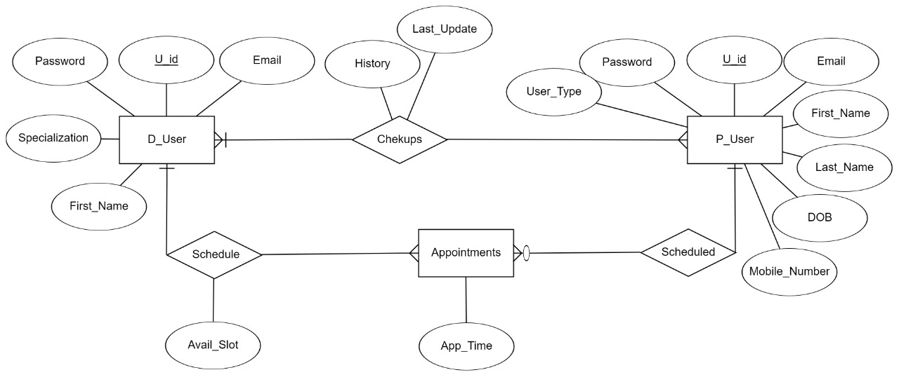
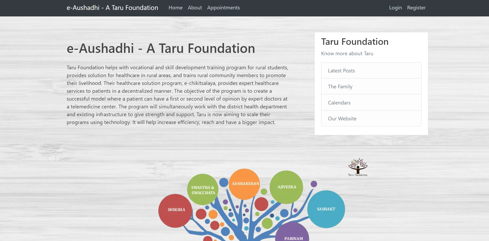
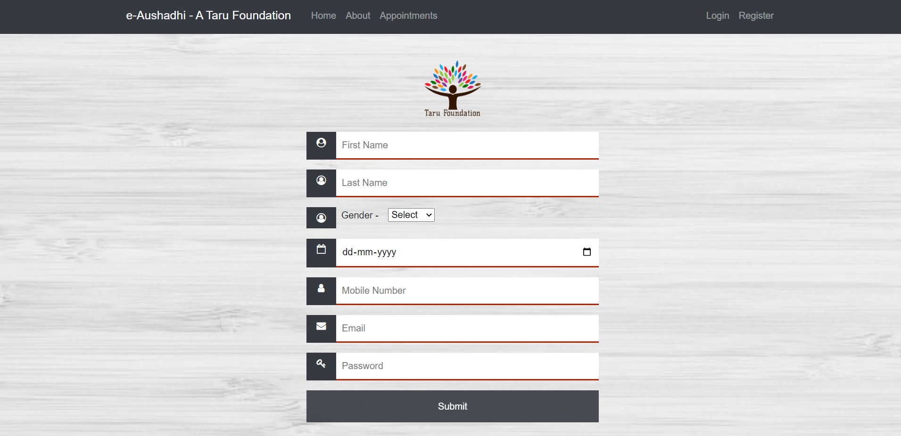
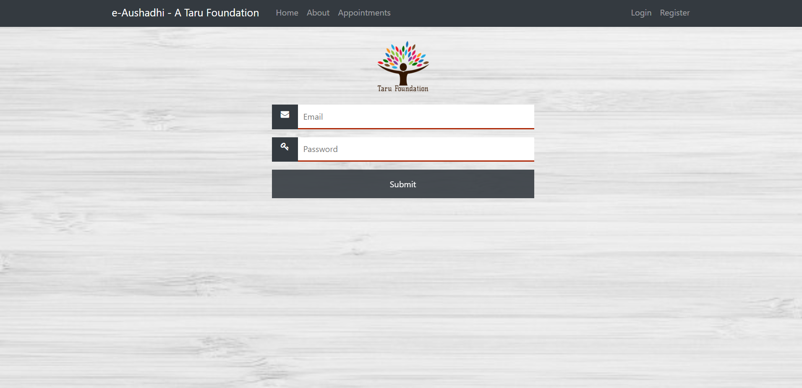
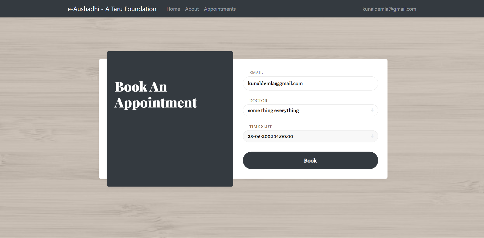
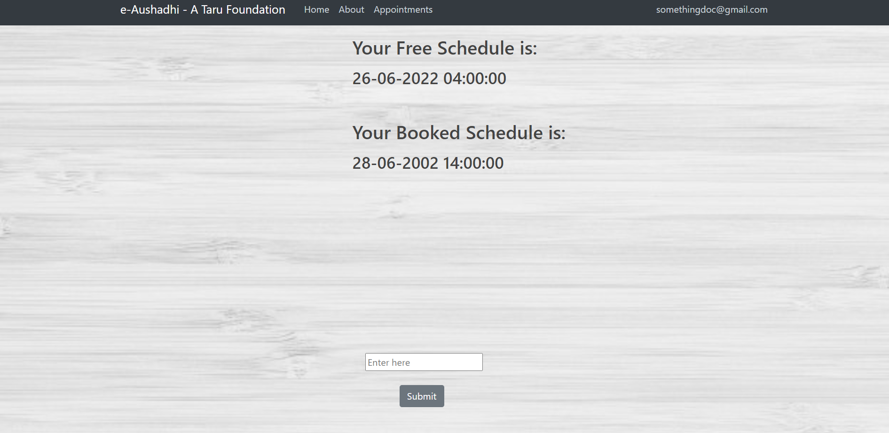

     

# e-Aushadhi

The recent COVID-19 pandemic has resulted in a huge surge in the number of online doctor consultations in India. Reports suggest that India saw a 30X spike in online doctor consultations, and the demand was consistently up, even after the first wave died down. e-Aushadhi consultations are especially beneficial for those who want a second opinion or people who cannot travel long distances to hospitals easily. The issue we tried to tackle with our application is twofold: 
1) One of manual appointment booking and other procedures. 
2) Bridging the gap between the patients living in rural areas (with limited access to expert doctors ) and urban doctors. 

There are three parts to the application: the doctor, the patient, and the rural medical representative.  Patients can visit the portal and sign up for the first time or login. To book an appointment, they can choose their preferred doctor and book an appointment with the said doctor based on the date the doctor is free on. Once the appointment is booked, the doctor will be able to see the patient's name along with the date for which they have been booked in the doctor’s schedule. On clicking the patient name, the doctor will  be redirected to the patient's previous visits, vitals and other medical history. 
For patients who have limited access/knowledge of technology, rural medical representatives will be able to book the appointments on their behalf. A rural medical representative will be able to see all the patients under him and make appointments for them.

## Features

- Connects patients, rural medical representatives and expert doctors.
- Record vitals, patient history and schedule appointments.
- Doctors can view their schedules, accept appointments and publish their free slots

## Techstack

- HTML
- CSS
- Javascript
- PHP
- SQL

## Entity Relationship Diagram

     

## Pages
### Home Page

     

### The Sign-Up Page:

     

The user can sign up to the portal using their email ids. Every registered patient will be assigned a patient id that will help them and the doctors to access their records. They would be redirected to the page where they can book an appointment.

### The Login Page:

     

Registered users can login using their credentials and they would also be redirected to the page 
where they can book an appointment.

### The Appointment Page:

     

     

This page would let the user book an appointment to consult their preferred doctor. They need to provide the id assigned to them. Then, choose the doctor they would like to consult. At last, they would be required to choose a time slot for the appointment from the available free slots of the doctor.

## Future Scope:

We have thought of adding a feature that the doctor can use to determine from the patient’s previous medical history records and other vitals his/her chances of having a particular disease. For instance, using the blood pressure records from previous consultations, an analysis and prediction tool can be implemented that will help the doctor determine how likely that person is to get a heart attack in the near future.
